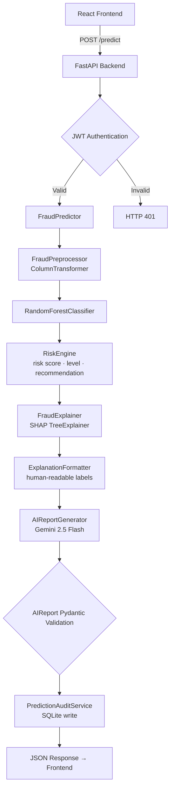

# FinGuard AI

**FinGuard AI** is a full-stack, AI-powered financial fraud detection and risk assessment platform. It analyzes payment transactions in real time using a trained Random Forest classifier, quantifies risk through a deterministic risk engine, and produces SHAP-based feature explanations alongside a structured AI-generated analyst report powered by Google Gemini. The system is backed by a FastAPI REST API with JWT authentication, role-based access control, and a SQLite audit database — all presented through a modern React dashboard.

---

## Table of Contents

- [Overview](#overview)
- [Key Features](#key-features)
- [System Architecture](#system-architecture)
- [Technology Stack](#technology-stack)
- [Machine Learning Pipeline](#machine-learning-pipeline)
- [Risk Engine](#risk-engine)
- [Explainability](#explainability)
- [AI Report Generation](#ai-report-generation)
- [API Documentation](#api-documentation)
- [Authentication & Authorization](#authentication--authorization)
- [Frontend Architecture](#frontend-architecture)
- [Backend Architecture](#backend-architecture)
- [Project Structure](#project-structure)
- [Installation](#installation)
- [Running the Application](#running-the-application)

---

## Overview

Financial fraud causes significant losses across payment networks every year. Detecting it in real time — and explaining why a transaction was flagged — is a core challenge for financial systems.

FinGuard AI addresses this by providing a complete fraud evaluation pipeline:

1. A transaction is submitted with its payment type, amount, and account balance states.
2. The backend applies a trained Random Forest model to produce a fraud probability.
3. A deterministic risk engine converts that probability into a normalized risk score (0–100), a categorical risk level (`LOW`, `MEDIUM`, `HIGH`, `CRITICAL`), and a recommended action.
4. SHAP (SHapley Additive exPlanations) identifies which features increased or decreased the fraud risk in that specific transaction.
5. Google Gemini generates a structured, constrained analyst-style report that summarizes the existing ML assessment in plain language. Gemini does not produce a new prediction — it explains the one the model already made.
6. Every prediction is stored in a SQLite audit database linked to the authenticated user.
7. The result is presented in a React dashboard with role-gated views for regular users, analysts, and administrators.

---

## Key Features

### Fraud Detection

- Real-time transaction analysis via `POST /predict`
- Random Forest classifier with class-weight imbalance handling
- Configurable fraud probability threshold (default: **0.60**)
- Fraud probability output (0.0 – 1.0)
- Normalized risk score (0 – 100, computed as `fraud_probability × 100`)
- Categorical risk level: `LOW`, `MEDIUM`, `HIGH`, `CRITICAL`
- Deterministic recommendation: `ALLOW`, `ALLOW_WITH_MONITORING`, `REVIEW`, `BLOCK_OR_REVIEW`

### Explainable AI

- SHAP `TreeExplainer` applied to every prediction
- Top-5 risk factors (features increasing fraud probability)
- Top-5 protective factors (features reducing fraud probability)
- Human-readable feature labels (e.g. `"Origin balance pattern"` instead of raw column names)
- Each factor includes: feature name, raw value, absolute SHAP impact, and direction

### AI Reporting

- Powered by **Google Gemini 2.5 Flash** (`gemini-2.5-flash`)
- Gemini receives the existing ML result (prediction, probability, risk score, risk level, recommendation, SHAP explanation) via a tightly constrained prompt
- Gemini produces a structured report with three fields: `summary`, `risk_reason`, `recommended_action`
- The response is validated against the `AIReport` Pydantic schema before it is returned
- **Gemini does not make a new fraud prediction.** It does not modify the fraud probability, risk score, risk level, or recommendation. It only explains the ML-generated assessment in plain language.

### Authentication & Authorization

- User registration with bcrypt password hashing
- Login via `POST /auth/login`, returning a signed JWT (HS256)
- Token expiry: 60 minutes
- JWT stored on the frontend under `localStorage` key `finguard_token`
- Active/inactive account enforcement on every authenticated request
- Role-based authorization enforced server-side via dependency injection
- Three roles: `USER`, `ANALYST`, `ADMIN`

### User Features (all authenticated roles)

- Submit transaction analysis
- View fraud probability, risk score, risk level, and recommendation
- View SHAP risk and protective factors
- View the Gemini AI analyst report
- View personal prediction history

### Analyst Features (`ANALYST` and `ADMIN`)

- Dashboard statistics: total predictions, fraud count, non-fraud count, fraud rate, average risk score
- Risk tier distribution: count of `LOW`, `MEDIUM`, `HIGH`, `CRITICAL` predictions across all users
- Recent predictions feed

### Admin Features (`ADMIN` only)

- View all registered users (username, email, role, active status)
- Change any user's role (`USER` → `ANALYST` → `ADMIN`)
- Activate or deactivate user accounts
- Admin self-protection: an admin cannot change their own role or deactivate their own account (enforced server-side)

---

## System Architecture



**Separation of concerns:**
- **Frontend** — React + Vite SPA, handles display and user interaction only
- **Backend** — FastAPI application, orchestrates all services, enforces auth/authz
- **ML Pipeline** — standalone Python package (`ml_pipeline/`), handles preprocessing, model inference, risk scoring, and SHAP
- **AI Reporting** — `AIReportGenerator` service calls Gemini with a constrained prompt and validates the response
- **Database / Audit** — SQLite via SQLAlchemy, stores users and prediction audit records

---

## Technology Stack

### Frontend

| Technology | Version | Purpose |
|---|---|---|
| React | 19.x | UI component framework |
| Vite | 8.x | Build tool and dev server |
| JavaScript / JSX | ES2022+ | Component logic |
| Vanilla CSS | — | Styling and design system |
| lucide-react | latest | Icon library |

### Backend

| Technology | Version | Purpose |
|---|---|---|
| Python | 3.11 | Runtime |
| FastAPI | 0.141 | REST API framework |
| Uvicorn | 0.52 | ASGI server |
| Pydantic | 2.x | Request/response validation and schema enforcement |
| SQLAlchemy | 2.0 | ORM and database access |
| python-jose | 3.x | JWT creation and validation (HS256) |
| bcrypt | 5.x | Password hashing |
| python-dotenv | 1.x | Environment variable loading |
| Starlette | 1.x | ASGI middleware and CORS |

### Machine Learning

| Technology | Version | Purpose |
|---|---|---|
| scikit-learn | 1.9 | RandomForestClassifier, preprocessing pipeline |
| XGBoost | 3.2 | Trained during evaluation phase |
| LightGBM | 4.7 | Trained during evaluation phase |
| SHAP | 0.51 | TreeExplainer for feature-level explanations |
| pandas | 3.x | Data loading and feature engineering |
| NumPy | 2.x | Numerical operations |
| joblib | 1.5 | Model and preprocessor artifact serialization |
| scipy | 1.17 | Sparse matrix support |

### AI

| Technology | Version | Purpose |
|---|---|---|
| Google Gemini 2.5 Flash | via `google-genai` | Analyst report generation |
| google-genai | 2.18 | Gemini API client |

### Database

| Technology | Purpose |
|---|---|
| SQLite | Persistent storage for users and prediction audit records |
| `finguard.db` | Single-file database at `backend/app/database/finguard.db` |

---

## Machine Learning Pipeline

### Dataset

The pipeline is built for the **PaySim** synthetic financial transaction dataset (`paysim.csv`). PaySim simulates mobile money transactions and includes labeled fraud cases. Raw identifier columns (`nameOrig`, `nameDest`) are intentionally excluded from the model feature set.

### Feature Engineering

Four balance-consistency features are computed from raw transaction fields:

| Engineered Feature | Formula | Purpose |
|---|---|---|
| `origin_balance_error` | `oldbalanceOrg - amount - newbalanceOrig` | Detects inconsistency in origin account balance after transaction |
| `destination_balance_error` | `oldbalanceDest + amount - newbalanceDest` | Detects inconsistency in destination account balance after transaction |
| `origin_balance_change` | `oldbalanceOrg - newbalanceOrig` | Net debit from origin account |
| `destination_balance_change` | `newbalanceDest - oldbalanceDest` | Net credit to destination account |

These four features, combined with the original transaction fields, form the 12-column feature contract used by the preprocessor and model.

### Preprocessing

The `FraudPreprocessor` uses a scikit-learn `ColumnTransformer` with two sub-pipelines:

**Numeric pipeline** (applied to 11 columns):
- `SimpleImputer(strategy="median")` — handles missing values

**Categorical pipeline** (applied to `type`):
- `SimpleImputer(strategy="most_frequent")` — handles missing values
- `OneHotEncoder(handle_unknown="ignore", sparse_output=True)` — encodes transaction type

The preprocessor is fitted on training data only and serialized to `ml_pipeline/models/preprocessor.pkl` via joblib. The same fitted artifact is loaded at inference time, ensuring consistent feature transformation.

### Dataset Split

| Split | Ratio |
|---|---|
| Training | 70% |
| Validation | 15% |
| Test | 15% |

### Models Trained

During the training phase, five baseline classifiers are trained and evaluated. All support class-weight imbalance handling:

| Model | Config |
|---|---|
| Logistic Regression | `max_iter=1000`, `solver=liblinear`, class weights |
| Decision Tree | `max_depth=10`, class weights |
| Random Forest | `n_estimators=150`, `max_depth=12`, class weights |
| XGBoost | `n_estimators=200`, `max_depth=6`, `learning_rate=0.1`, `scale_pos_weight` |
| LightGBM | `n_estimators=200`, `max_depth=6`, `learning_rate=0.1`, `scale_pos_weight` |

Primary evaluation metric: **F1 score**.

### Production Model

The production inference pipeline loads `ml_pipeline/models/random_forest.pkl`. All trained model artifacts are serialized to `ml_pipeline/models/`.

### Inference Flow

```
Raw transaction dict
    ↓
pd.DataFrame([transaction])
    ↓
FraudPreprocessor.transform()   ← fitted ColumnTransformer
    ↓
RandomForestClassifier.predict_proba()
    ↓
fraud_probability (float, 0.0 – 1.0)
    ↓
RiskEngine.evaluate()           ← risk score, level, recommendation
    ↓
FraudExplainer.explain()        ← SHAP TreeExplainer, top-10 features
    ↓
ExplanationFormatter.format()   ← risk factors / protective factors, top-5
    ↓
AIReportGenerator.generate()    ← Gemini 2.5 Flash, constrained prompt
    ↓
AIReport Pydantic validation
    ↓
PredictionAuditService          ← SQLite write
    ↓
PredictionResponse JSON
```

---

## Risk Engine

The `RiskEngine` (`ml_pipeline/risk/risk_engine.py`) converts ML fraud probability into a deterministic application-level risk decision. It does not modify or retrain the ML model.

### Risk Score

```
risk_score = round(fraud_probability × 100, 2)
```

Range: 0 (lowest risk) to 100 (highest risk).

### Risk Levels

| Level | Condition |
|---|---|
| `LOW` | `fraud_probability < 0.20` |
| `MEDIUM` | `0.20 ≤ fraud_probability < 0.40` |
| `HIGH` | `0.40 ≤ fraud_probability < fraud_threshold` |
| `CRITICAL` | `fraud_probability ≥ fraud_threshold` |

### Recommendations

| Recommendation | Condition |
|---|---|
| `ALLOW` | `fraud_probability < 0.20` |
| `ALLOW_WITH_MONITORING` | `0.20 ≤ fraud_probability < 0.40` |
| `REVIEW` | `0.40 ≤ fraud_probability < fraud_threshold` |
| `BLOCK_OR_REVIEW` | `fraud_probability ≥ fraud_threshold` |

The fraud threshold defaults to **0.60** and is defined in `ml_pipeline/config/config.py`. The prediction label (`0` = genuine, `1` = fraud) is derived from `fraud_probability >= fraud_threshold`.

---

## Explainability

SHAP explanations are generated by `FraudExplainer` (`ml_pipeline/explainability/shap_explainer.py`) using `shap.TreeExplainer`, which is optimized for tree-based models like Random Forest.

**Process:**
1. `shap.TreeExplainer(model)` is initialized once at predictor load time.
2. For each prediction, `explainer.shap_values(X)` is called on the preprocessed single-transaction matrix.
3. SHAP values indicate each feature's marginal contribution to the fraud probability.
4. The top 10 features by absolute SHAP value are returned.

**ExplanationFormatter** (`ml_pipeline/explainability/explanation_formatter.py`) then:
- Maps internal feature names (e.g. `numeric__origin_balance_error`) to human-readable labels (e.g. `"Origin balance pattern"`)
- Separates features into **risk factors** (positive SHAP value → increases fraud probability) and **protective factors** (negative SHAP value → reduces fraud probability)
- Skips inactive one-hot encoded transaction type categories (zero-valued)
- Returns the top 5 of each group, sorted by impact magnitude

Each factor in the response includes:
```json
{
  "feature": "Origin balance pattern",
  "value": 181.0,
  "impact": 0.042317,
  "direction": "increases_fraud_risk"
}
```

The explanation is derived entirely from the trained model's output and does not constitute an independent prediction system.

---

## AI Report Generation

`AIReportGenerator` (`backend/app/services/ai_report_generator.py`) calls **Gemini 2.5 Flash** using the `google-genai` client with `response_mime_type: application/json` to enforce structured output.

### Flow

```
Existing ML result (prediction, probability, risk score, risk level,
    recommendation, SHAP explanation)
    ↓
Constrained prompt construction (_build_prompt)
    ↓
Gemini 2.5 Flash (gemini-2.5-flash) API call
    ↓
JSON response parsing
    ↓
AIReport Pydantic validation (summary, risk_reason, recommended_action)
    ↓
Validated report returned as part of PredictionResponse
```

### Safety Constraints Implemented in the Prompt

The prompt instructs Gemini to:

- Act only as an **explanation layer**, not a prediction system
- Use **only** the supplied ML result and SHAP information
- **Not** produce a new fraud prediction
- **Not** change the fraud probability, risk score, risk level, or recommendation
- **Not** invent facts, infer user intent, location, transaction history, or any information not provided
- Return only the three required JSON fields

The response is validated against the `AIReport` Pydantic schema before it is delivered to the frontend. If the response is malformed or fails validation, a `RuntimeError` is raised and the prediction request fails cleanly.

> **Note:** Prompt-based constraints reduce the likelihood of scope drift but do not constitute an absolute guarantee. The structural Pydantic validation ensures schema correctness.

---

## API Documentation

The FastAPI application exposes an interactive OpenAPI interface at `http://127.0.0.1:8000/docs` when the backend is running.

### Health

| Method | Path | Auth | Role | Purpose |
|---|---|---|---|---|
| `GET` | `/health` | None | None | Check API and model status |

**Response:**
```json
{ "status": "healthy", "model_loaded": true }
```

---

### Authentication

| Method | Path | Auth | Role | Purpose |
|---|---|---|---|---|
| `POST` | `/auth/register` | None | None | Register a new user |
| `POST` | `/auth/login` | None | None | Authenticate and receive a JWT |

**Register request:**
```json
{
  "username": "analyst_user",
  "email": "user@example.com",
  "password": "securepassword"
}
```

**Login request:**
```json
{
  "username": "analyst_user",
  "password": "securepassword"
}
```

**Login response:**
```json
{
  "access_token": "<jwt>",
  "token_type": "bearer"
}
```

---

### Prediction

| Method | Path | Auth | Role | Purpose |
|---|---|---|---|---|
| `POST` | `/predict` | Bearer JWT | USER, ANALYST, ADMIN | Analyze a transaction for fraud |

**Request body:**
```json
{
  "step": 1,
  "type": "TRANSFER",
  "amount": 181.0,
  "oldbalanceOrg": 181.0,
  "newbalanceOrig": 0.0,
  "oldbalanceDest": 0.0,
  "newbalanceDest": 0.0,
  "isFlaggedFraud": 0,
  "origin_balance_error": 0.0,
  "destination_balance_error": -181.0,
  "origin_balance_change": 181.0,
  "destination_balance_change": 0.0
}
```

Valid `type` values: `CASH_IN`, `CASH_OUT`, `DEBIT`, `PAYMENT`, `TRANSFER`

**Response:**
```json
{
  "prediction": 1,
  "fraud_probability": 0.924185,
  "risk_score": 92.42,
  "risk_level": "CRITICAL",
  "recommendation": "BLOCK_OR_REVIEW",
  "explanation": {
    "risk_factors": [
      { "feature": "Origin balance pattern", "value": 0.0, "impact": 0.0423, "direction": "increases_fraud_risk" }
    ],
    "protective_factors": [
      { "feature": "Transaction time step", "value": 1.0, "impact": 0.0012, "direction": "reduces_fraud_risk" }
    ]
  },
  "ai_report": {
    "summary": "...",
    "risk_reason": "...",
    "recommended_action": "BLOCK_OR_REVIEW"
  }
}
```

---

### User

| Method | Path | Auth | Role | Purpose |
|---|---|---|---|---|
| `GET` | `/predictions/history` | Bearer JWT | USER, ANALYST, ADMIN | Retrieve the current user's prediction history |

---

### Analyst

| Method | Path | Auth | Role | Purpose |
|---|---|---|---|---|
| `GET` | `/analyst/dashboard` | Bearer JWT | ANALYST, ADMIN | Analyst access confirmation |
| `GET` | `/analyst/dashboard/stats` | Bearer JWT | ANALYST, ADMIN | Aggregate prediction statistics |
| `GET` | `/analyst/dashboard/risk-distribution` | Bearer JWT | ANALYST, ADMIN | Count of predictions per risk tier |
| `GET` | `/analyst/dashboard/recent-predictions` | Bearer JWT | ANALYST, ADMIN | Recent prediction records |

---

### Admin

| Method | Path | Auth | Role | Purpose |
|---|---|---|---|---|
| `GET` | `/admin/dashboard` | Bearer JWT | ADMIN | Admin access confirmation |
| `GET` | `/admin/users` | Bearer JWT | ADMIN | List all registered users |
| `PATCH` | `/admin/users/{user_id}/role` | Bearer JWT | ADMIN | Change a user's role |
| `PATCH` | `/admin/users/{user_id}/status` | Bearer JWT | ADMIN | Activate or deactivate a user |

**Role update request:**
```json
{ "role": "ANALYST" }
```

**Status update request:**
```json
{ "is_active": false }
```

---

## Authentication & Authorization

### Flow

```
POST /auth/register  →  bcrypt password hash  →  user created (role: USER)
POST /auth/login     →  credentials verified  →  JWT (HS256) issued (60 min TTY)
Frontend             →  token stored in localStorage["finguard_token"]
Authenticated API    →  Authorization: Bearer <token>
Backend              →  JWT decoded and verified
                     →  user looked up in database
                     →  account active check
                     →  role-based dependency (require_roles) applied
```

### Roles

| Role | Access |
|---|---|
| `USER` | `POST /predict`, `GET /predictions/history` |
| `ANALYST` | All USER routes + `/analyst/dashboard/*` |
| `ADMIN` | All ANALYST routes + `/admin/*` |

Role enforcement is implemented server-side in `backend/app/auth/authorization.py` using FastAPI dependency injection. Frontend role checks are for display-only purposes and do not substitute for backend authorization.

**Admin self-protection:** The backend explicitly prevents an admin from changing their own role or deactivating their own account. This is enforced by comparing the authenticated admin's database `id` against the target `user_id`.

---

## Frontend Architecture

The frontend is a React + Vite single-page application structured around a state-based view router in `App.jsx`. Navigation between views is controlled by an `activeTab` state variable, with navigation items rendered based on the authenticated user's role decoded from the JWT payload.

### Component Map

| Component | Purpose |
|---|---|
| `App.jsx` | Application shell, sidebar navigation, JWT state, view routing, backend health check |
| `Login.jsx` | Authentication form, JWT storage, login API call |
| `Register.jsx` | Registration form, user creation API call |
| `TransactionForm.jsx` | Transaction input form, client-side validation, computes balance-consistency fields before submission |
| `PredictionResult.jsx` | Renders fraud assessment result, risk score gauge, SHAP factor breakdown, AI report |
| `PredictionHistory.jsx` | Fetches and renders the current user's prediction history |
| `AnalystDashboard.jsx` | Renders KPI statistics, risk tier distribution, and recent predictions (ANALYST and ADMIN only) |
| `AdminDashboard.jsx` | Renders user management controls, role assignment, account activation (ADMIN only) |

### API Service Layer

| File | Purpose |
|---|---|
| `services/api.js` | All API calls. Base URL: `http://127.0.0.1:8000`. Reads JWT from `localStorage["finguard_token"]` for authenticated requests. |
| `services/auth.js` | JWT payload decoding, `getCurrentUser()`, `getUserRole()`, `isAuthenticated()` |

### Directory Structure

```
frontend/src/
├── App.jsx                     # Application shell and view router
├── App.css                     # Component layout and design system
├── index.css                   # CSS design tokens and base styles
├── main.jsx                    # React entry point
├── components/
│   ├── Login.jsx
│   ├── Register.jsx
│   ├── TransactionForm.jsx
│   ├── PredictionResult.jsx
│   ├── PredictionHistory.jsx
│   ├── AnalystDashboard.jsx
│   └── AdminDashboard.jsx
└── services/
    ├── api.js
    └── auth.js
```

---

## Backend Architecture

The backend is a single FastAPI application (`backend/app/main.py`) that imports and wires together independently implemented service modules.

### Module Map

| Module / File | Purpose |
|---|---|
| `app/main.py` | FastAPI app definition, all route handlers, CORS, global error handler |
| `app/schemas.py` | All Pydantic request and response models |
| `app/auth/security.py` | Password hashing (bcrypt), JWT creation/decoding (python-jose HS256), `get_current_user` dependency |
| `app/auth/auth_service.py` | Login logic — credential lookup and token generation |
| `app/auth/user_service.py` | Registration logic — user creation |
| `app/auth/authorization.py` | `require_roles()` FastAPI dependency factory for role enforcement |
| `app/auth/admin_service.py` | Role update, status update with self-protection checks |
| `app/auth/bootstrap_admin.py` | Utility to create an initial admin account |
| `app/auth/bootstrap_analyst.py` | Utility to create an initial analyst account |
| `app/database/database.py` | SQLAlchemy engine, session factory, `init_db()`, SQLite connection |
| `app/database/models.py` | `User` and `PredictionAudit` SQLAlchemy ORM models |
| `app/services/prediction_audit_service.py` | Writes prediction results to `PredictionAudit`, retrieves user prediction history |
| `app/services/dashboard_service.py` | Aggregates prediction audit records for analyst dashboard stats, risk distribution, and recent predictions |
| `app/services/ai_report_generator.py` | Gemini API client, prompt construction, JSON parsing, `AIReport` validation |

---

## Project Structure

```
FinGuard-AI/
├── .env                                # Environment variables (not committed)
├── pyproject.toml                      # Python project metadata
├── paysim.csv                          # PaySim dataset (not committed to VCS)
│
├── backend/
│   └── app/
│       ├── main.py                     # FastAPI application and routes
│       ├── schemas.py                  # Pydantic request/response models
│       ├── auth/
│       │   ├── security.py             # JWT and bcrypt utilities
│       │   ├── auth_service.py         # Login logic
│       │   ├── user_service.py         # Registration logic
│       │   ├── authorization.py        # Role enforcement dependency
│       │   ├── admin_service.py        # Admin user management
│       │   ├── bootstrap_admin.py      # Initial admin account creation
│       │   └── bootstrap_analyst.py    # Initial analyst account creation
│       ├── database/
│       │   ├── database.py             # SQLAlchemy engine and session
│       │   ├── models.py               # User and PredictionAudit ORM models
│       │   └── finguard.db             # SQLite database file
│       └── services/
│           ├── ai_report_generator.py  # Gemini AI report generation
│           ├── dashboard_service.py    # Analyst dashboard aggregations
│           └── prediction_audit_service.py  # Prediction history writes/reads
│
├── frontend/
│   ├── index.html
│   ├── package.json
│   ├── vite.config.js
│   └── src/
│       ├── App.jsx                     # Application shell
│       ├── App.css                     # Layout and component styles
│       ├── index.css                   # Design tokens and global styles
│       ├── main.jsx                    # React entry point
│       ├── components/
│       │   ├── Login.jsx
│       │   ├── Register.jsx
│       │   ├── TransactionForm.jsx
│       │   ├── PredictionResult.jsx
│       │   ├── PredictionHistory.jsx
│       │   ├── AnalystDashboard.jsx
│       │   └── AdminDashboard.jsx
│       └── services/
│           ├── api.js                  # All API calls
│           └── auth.js                 # JWT parsing utilities
│
└── ml_pipeline/
    ├── pipeline_runner.py              # Training pipeline orchestrator
    ├── config/
    │   ├── config.py                   # MLConfig (threshold, split ratios, model names)
    │   └── paths.py                    # Artifact file paths
    ├── data/
    │   ├── data_loader.py              # CSV loading
    │   ├── feature_engineering.py      # Balance-consistency feature computation
    │   ├── dataset_splitter.py         # Train/val/test split
    │   └── data_inspector.py           # Dataset inspection utilities
    ├── preprocessing/
    │   ├── preprocessor.py             # FraudPreprocessor (ColumnTransformer)
    │   └── imbalance_handler.py        # Class weight computation
    ├── training/
    │   └── trainer.py                  # ModelTrainer (RF, XGB, LGBM, DT, LR)
    ├── evaluation/                     # Model evaluation utilities
    ├── explainability/
    │   ├── shap_explainer.py           # FraudExplainer (SHAP TreeExplainer)
    │   └── explanation_formatter.py    # ExplanationFormatter (human-readable labels)
    ├── inference/
    │   └── predictor.py                # FraudPredictor (complete inference pipeline)
    ├── risk/
    │   └── risk_engine.py              # RiskEngine (score, level, recommendation)
    ├── models/                         # Serialized model and preprocessor artifacts
    │   ├── random_forest.pkl           # Production model
    │   ├── xgboost.pkl
    │   ├── lightgbm.pkl
    │   ├── decision_tree.pkl
    │   ├── logistic_regression.pkl
    │   └── preprocessor.pkl
    └── reports/                        # Evaluation reports and figures
```

---

## Installation

### Prerequisites

- Python 3.11
- Node.js 18+ and npm
- A Google Gemini API key (obtain from [Google AI Studio](https://aistudio.google.com/))

### Backend Setup

```bash
# From the project root
cd backend

# Create a virtual environment
python -m venv .venv

# Activate (Windows)
.venv\Scripts\activate

# Activate (macOS/Linux)
source .venv/bin/activate

# Install dependencies
pip install -r requirements.txt
```

### Environment Variables

Create a `.env` file in the project root (`FinGuard-AI/.env`):

```env
GEMINI_API_KEY=your_gemini_api_key_here
JWT_SECRET_KEY=your_secure_random_jwt_secret_here
```

> **Important:** `JWT_SECRET_KEY` should be a long, randomly generated string. Do not use the example value in production.

### Frontend Setup

```bash
# From the project root
cd frontend

# Install dependencies
npm install
```

---

## Running the Application

### Backend

Start the FastAPI server from the project root:

```bash
backend\.venv\Scripts\python.exe -m uvicorn backend.app.main:app --host 127.0.0.1 --port 8000 --reload
```

The API will be available at `http://127.0.0.1:8000`.  
Interactive API documentation: `http://127.0.0.1:8000/docs`

### Frontend

```bash
cd frontend
npm run dev
```

The frontend will be available at `http://localhost:5173`.

### Running Both Simultaneously

Open two separate terminals:

**Terminal 1 — Backend:**
```bash
backend\.venv\Scripts\python.exe -m uvicorn backend.app.main:app --host 127.0.0.1 --port 8000 --reload
```

**Terminal 2 — Frontend:**
```bash
cd frontend && npm run dev
```

> The frontend is pre-configured to call `http://127.0.0.1:8000`. The backend allows CORS from `http://localhost:5173`.

### Verifying the Setup

Check backend health:
```bash
curl http://127.0.0.1:8000/health
```

Expected response:
```json
{ "status": "healthy", "model_loaded": true }
```

---

## Notes

- The ML model artifacts in `ml_pipeline/models/` must exist before starting the backend. If they are missing, run the training pipeline via `pipeline_runner.py`.
- The SQLite database (`finguard.db`) is created automatically on first run via `init_db()`.
- The PaySim dataset (`paysim.csv`) is required only for training. It is not needed to run the inference server.
- By default, new accounts are assigned the `USER` role. Use the bootstrap scripts or admin dashboard to promote accounts to `ANALYST` or `ADMIN`.
